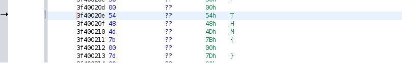
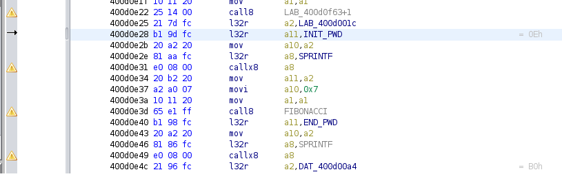
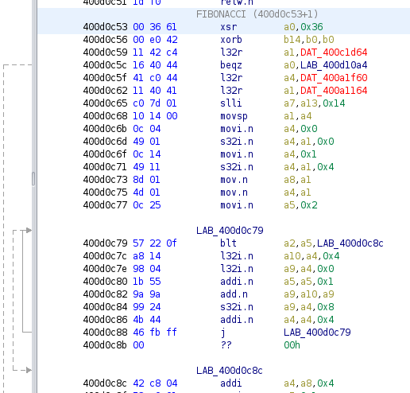
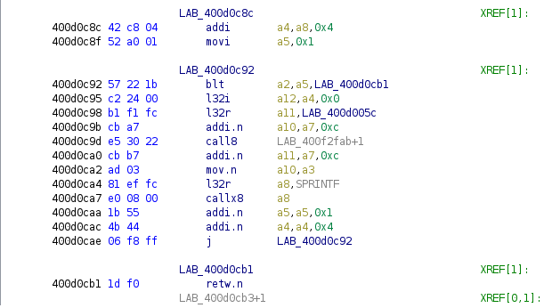

## Official Writeup of THM_Gate Room on TryHackMe
To solve this CTF room it is necessary to reverse the provided firmware.bin

The first difficulty for the reverser is that the processor is an ESP32 from Espressif, it is not an ARM, nor X86, nor MIPS, 
it is based on Xtensa Tensilica with its own instruction set.

Xtensa is not natively supported by Ghidra or IDA, but there are several plugin out there that can be used:

https://github.com/Ebiroll/ghidra-xtensa

https://github.com/Ebiroll/esp32_flash_loader

The first project adds Xtensa processor to Ghidra, the second allows a flash dump to be parsed/analyzed by Ghidra

Once you have your system configured you can go and reverse the firmware

# Question 1,2 and 3
What is the WiFi Access Point SSID?
What is the WiFi Access Point Password?
What is the user name for the login page?

The first three questions are somewhat easy because the answer is hidden in the defined strings,
so even Ghidra/IDA might be overkill for now, check and double check and you'll find the easy solutions

# Question 4
What is the password for the login page?

This last question is somewhat more complicated and requires an understanding of the disassembled code, because
you won't find it anymore in the defined strings.
The password for the login page is partially generated at runtime using a function.
In this case like suggested by the hint the password format is THM{.....}
So let's search in the memory if there are any reference to "THM{"
And yes! we found it in memory:

Searching for direct references you will find where it is used in the code, you can change the labels on the
instructions to help yourself solving the puzzle.

You can see that after loading the "THM{" string in the buffer a function is called which takes as arguments the number 7 and the buffer.
I've labeled this function FIBONACCI, let's see why:

Like shown in picture the function executes a loop (LAB_400d0c79) that fills an array summing a number with the preceding one (400d0c82),
the constructed array is pratically a Fibonacci series.

The next loop (LAB_400d0c92) writes the Fibonacci series in the buffer

After the Fibonacci function returns, a "}" is added to the buffer to end the password string

That's all, you got the flag!

